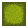

# Pollen Panic (Pacman-Java)

A modern, feature-rich Pacman-inspired game with a butterfly and bee theme, written in Java using Swing.

> **Theme:**
> - The main character is a butterfly (replacing Pacman).
> - The enemies are bees (replacing ghosts).
> - The pellets are pollen, and the powerups are flowers.
> - The maze walls are designed to look like honeycomb blocks.
> - All models and sprites (butterfly, bees, pollen, flowers, leaves walls) are custom-made by Jossanah Ellaine Peji.

> **This project was created by a group of 5 students from section BSCS 1-2 (A.Y. 2024-2025) to fulfill our final requirement in Computer Programming II (DCIT23), under Ms. Lourielene Baldomero.**

**Group Members:**
- Member 1: Zean Kurt Balboa
- Member 2: Zhanchary Concepcion
- Member 3: Ray Ardee Gaano
- Member 4: Jossanah Ellaine Peji
- Member 5: Clarence Villa

## Features
- Classic Pacman gameplay
- Power pellets and ghost-eating mode
- Multiple ghosts with smart AI (chase and flee)
- Ghosts respawn independently after being eaten
- Arcade-style maze and UI
- Scoring, lives, and high score tracking
- Restart button and responsive controls

## Prerequisite: Install Java (JDK)
1. **Download and Install Java JDK**
   - Go to the [Oracle JDK Downloads](https://www.oracle.com/java/technologies/downloads/) or [Adoptium Temurin](https://adoptium.net/) page.
   - Download the latest LTS version (Java 17 or Java 21 recommended) for your operating system.
   - Run the installer and follow the instructions.
2. **Verify Installation**
   - Open a terminal (Command Prompt, PowerShell, or Terminal) and run:
     ```sh
     java -version
     javac -version
     ```
   - You should see version information for both commands. If not, add Java to your system PATH.

## How to Run
1. **Clone this repository to your Desktop for easy navigation:**
   - Press <kbd>Win</kbd> + <kbd>D</kbd> to show the Desktop.
   - Right-click on an empty space on the Desktop and select `Open in Terminal` or `Open in PowerShell`.
   - Run the following command:
     ```sh
     git clone https://github.com/xKurty06/Pacman-Java.git
     ```
   - This will create a `Pacman-Java` folder on your Desktop.
2. Open the project in your favorite Java IDE (e.g., IntelliJ IDEA, Eclipse, VS Code with Java extensions).
3. Build and run `App.java` from the `src` folder.

## Step-by-Step: How to Run the App

### Visual Studio Code (VS Code)
1. **Install Java Extensions**
   - Install the "Extension Pack for Java" from Microsoft (includes Language Support, Debugger, etc).
2. **Open the Project**
   - Go to `File` > `Open Folder...` and select the `Pacman-Java` folder.
3. **Build and Run**
   - Open `src/App.java`.
   - Click the `Run` button at the top of the editor, or right-click in the file and select `Run Java`.
   - Alternatively, open the terminal and run:
     ```sh
     javac -d bin src/*.java
     java -cp bin App
     ```

### IntelliJ IDEA
1. **Open the Project**
   - Go to `File` > `Open...` and select the `Pacman-Java` folder.
2. **Configure SDK**
   - Make sure a Java SDK (JDK 8 or higher) is set for the project.
3. **Run the App**
   - In the Project view, open `src/App.java`.
   - Right-click `App.java` and select `Run 'App.main()'`.

### Eclipse
1. **Import the Project**
   - Go to `File` > `Open Projects from File System...` or `Import` > `General` > `Existing Projects into Workspace`.
   - Select the `Pacman-Java` folder.
2. **Set Java Build Path**
   - Ensure `src` is marked as a source folder.
   - Make sure a Java JRE is configured.
3. **Run the App**
   - In the Package Explorer, open `src/App.java`.
   - Right-click `App.java` and select `Run As` > `Java Application`.

## Controls
- Arrow keys: Move Pacman
- Restart button: Restart the game

## Screenshots


## Sample Sprites

Below are individual sample images for the main game models. All images are located in the `src/assets/` folder.

| Sprite         | Filename                |
| -------------- | ----------------------- |
| Butterfly Down |  |
| Butterfly Up   |      |
| Butterfly Left |  |
| Butterfly Right| |
| Bee 1          |                    |
| Bee 2          |                    |
| Bee 3          |                    |
| Bee 4          |                    |
| Scared Bee     |                    |
| Pollen         |                    |
| Flower         |                 |
| Wall (Leaves)|                     |

## License
This project is licensed under the MIT License. See [LICENSE](LICENSE) for details.

---

Enjoy playing Pacman in Java!
